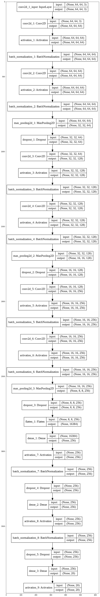
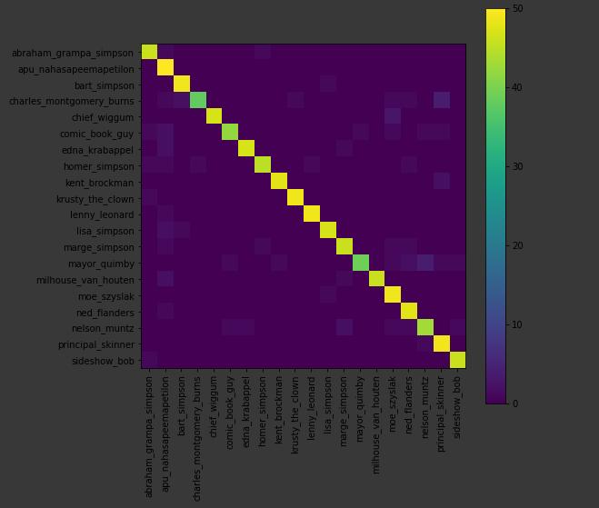

# SimpsonClassifierVGGM
Hello guys I bulit this Simpsons Classifier after being inspired from the VGG architecture (the repeated 3x3 convolution)

Here is a quick look at the flow of model:

Total params: 5,416,532

Trainable params: 5,413,716

Non-trainable params: 2,816

Training loss (categrical cross entropy): 0.4999

Training accuracy: 86.44% 

validation loss (categrical cross entropy): 0.6197

Validation accuracy: 92.38

